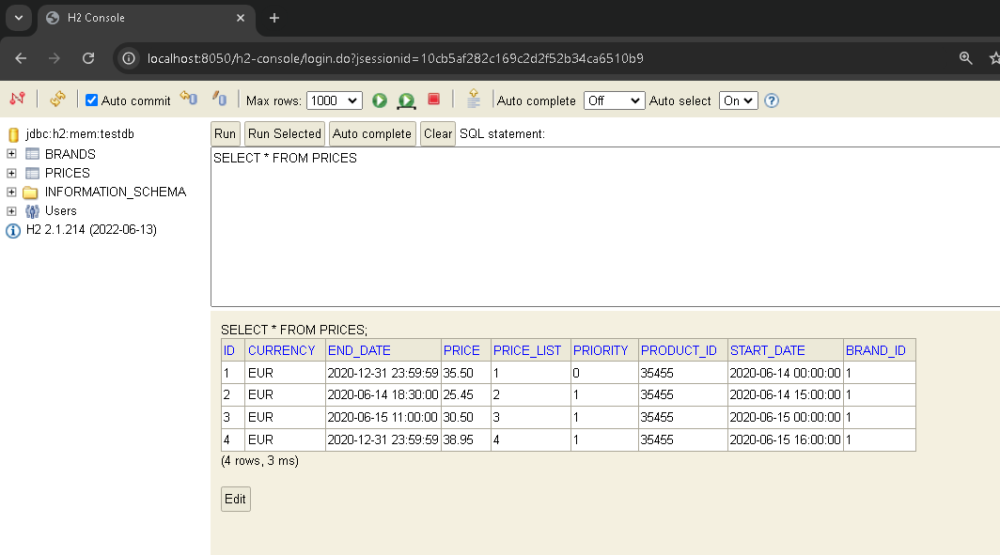
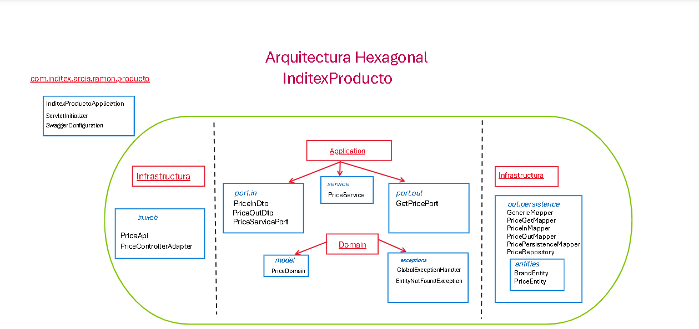
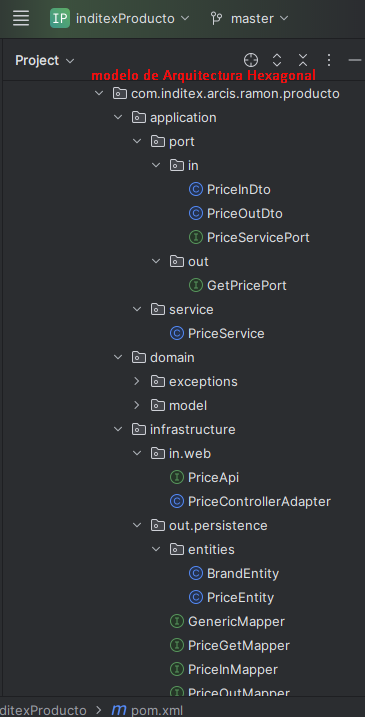
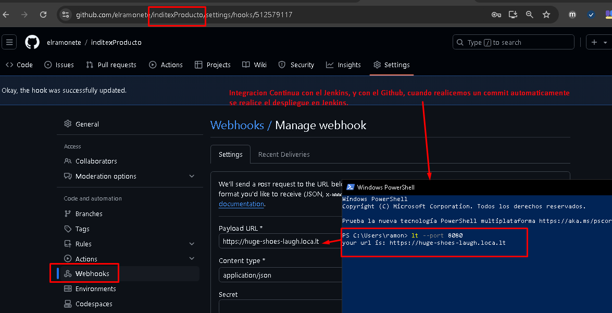
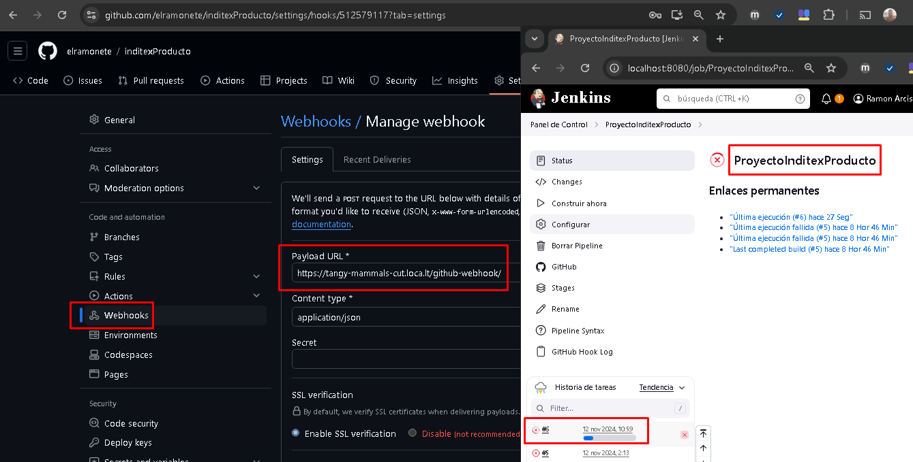
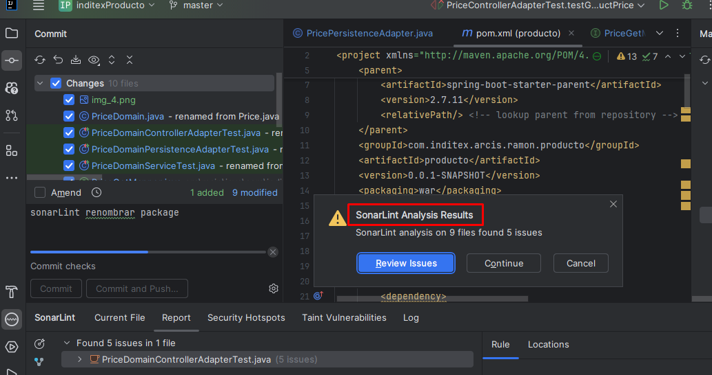

# Inditex Producto
Proyecto realizado para la prueba de inditex.

1-En este proyecto hemos priorizado el dominio del problema (DDD) sobre las tecnologías.
Nos facilitará el mantenimiento a largo plazo, y adaptable a los cambios del negocio.
2-Nos hemos basado en la Arquitectura Hexagonal, aisalmos el núcleo (logica de negocio)
de una aplicación de sus interfaces para interactuar con el exterior(bbdd, UI ...).
3-Nos hemos enfocado inicialmente con API First donde diseñamos y documentamos la API antes
de implementar cualquier otra parte de la aplicación (PriceApi), esto permite trabajar en 
paralelo tanto Front como en Back.
4-Para facilitar la integración de la API, hemos usado el OpenAPI mediante 
la herramienta Swagger UI, y además de otra plataforma mediante el Postman para probar las APIs REST.
5-CI/CD Integración Continua y Entrega Continua. Hemos automatizado el proceso de desarrollo desde 
la integracion del codigo hasta su despliegue en mi máquina, mediante el Jenkins, aumentando la frecuencia de despliegues.

En resumen, hemos creado una aplicacion de alta calidad, escalables y mantenibles. 
DDD nos proporciona un enfoque centrado en el dominio, 
la arquitectura hexagonal aísla la lógica de negocio,
API First asegura que la API sea la prioridad, OpenAPI define la API,
y CI/CD automatiza el proceso de desarrollo.

Hemos creado la capa de dominio (PriceDomain), para la buena practica en DDD y arquitectura Hexagonal,
ya que nos permite desacoplar la logica de negocio de la persistencia.
También para una estructura limpia, hemos utilizado Mapstruct para los mappers entre los DTO's y Domain, 
otro entre Domain y Entity para la persistencia, y otro entre Domain y DTO para 
la capa de presentacion.(PriceInDto, PriceOutDto, PriceDomain, PriceEntity) 

Para acceder a la base de datos al levantar el programa acceder a http://localhost:8050/h2-console

Los datos necesarios para ver la tabla son los siguientes:

Driver class: org.h2.Driver

JDBC url: jdbc:h2:mem:testdb

user: sa
rar
sin password

Teneis una interfaz swagger disponible para hacer las pruebas necesarias en http://localhost:8050/swagger-ui/

El proyecto se ha realizado con arquitectura hexagonal,
en esta arquitectura hay 3 partes diferenciadas, el **domain**, donde se encuentra
el dominio de la **aplicacion**, luego la segunda es la **aplicacion**, que es   
el corazon del aplicativo y donde se encuentra la clase PriceService y las interfaces (port) que a su vez, se comunican con la capa de la **infraestructura**, y por ultimo
la **infraestructura** que es donde he metido tanto los repositorios con acceso a bbdd incluidas las entidades como los controladores a traves de los cuales se conecta la applicacion con el exterior.
Y el MapStruct, donde transformamos los DTO's a Entity's, y viceversa, pasando por el Dominio.

Muestro una imagen como tenemos estructurado el proyecto:

IntelliJ Idea, modelo de Arquitectura Hexagonal:

En la parte de los tests tenemos test unitarios con mockito para los servicios y los adaptadores de los repositorios y he utilizado RestAssured para hacer una prueba 
endToEnd de los controladores. 

Las 5 pruebas que indicais que hay que realizar en la prueba estan implementadas en la clase **PriceControllerAdapterTest**.

Hemos añadido cada vez que realicemos un commit al repositorio GitHub,
automaticamente realizará un despliegue en Jenkins.

Añado una captura de pantalla :

Vemos que se despliega automáticamente nada más subir nuestro commit:

Hemos incluido el plugin SonarLint, para la calidad del codigo:

